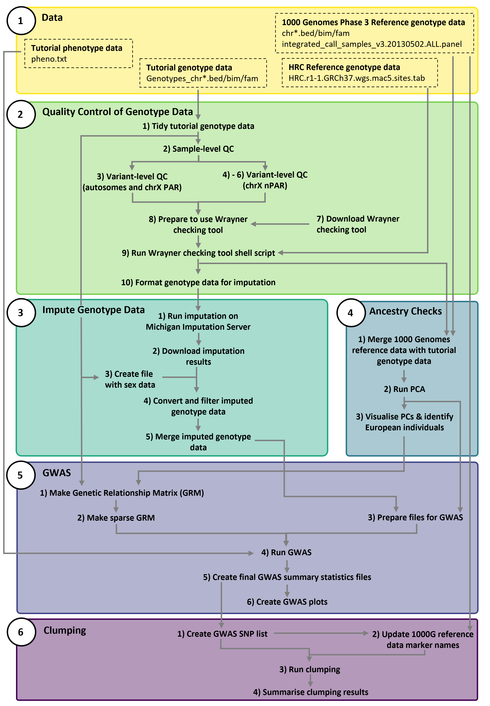

# Tutorial to run GWAS including the X chromosome

* The aim of this tutorial is to provide step-by-step instructions and scripts for performing a genome-wide association study (GWAS), starting from genotype data through to identifying the number of independent genome-wide significant SNPs.
* This tutorial covers the following steps, applied to both the autosomes and the **X chromosome**:
	- Quality control of genotype data
	- Imputation of genotype data
	- Genome-wide association study (GWAS)
	- Clumping to identify independent genome-wide significant SNPs
* Example genotype data is provided to use with this tutorial, or you can follow the workflow using your own genotype data


# Overview of Tutorial

* The flow diagram below gives an overview of the entire tutorial
* Note that the numbering used in the diagram aligns with the numbering used to name the directories and files




# Getting Started

## Clone the repository

* Clone this repository to get a local copy of all files

* In your terminal or HPC environment navigate to the location you would like to download a copy of all the files in this tutorial
* Then run the following code:

```bash
git clone https://github.com/jodithea/Tutorial_GWAS_including_X_chromosome.git
```

* You will now have a copy of all of the directories and files from this tutorial


## Option 1: Start from raw genotype data (full workflow)

* Use this if you want to run the tutorial from the beginning
* Download the Zenodo archive which contains the raw genotype data
	* Instructions in 01_Data/01_Download_raw_genotype_data_for_full_tutorial.md
	* This downlaods the file Tutorial_GWAS_including_X_chromosome_raw_genotype_data.tar.gz from the Zenodo archive: [](https://doi.org/10.5281/zenodo.17796417)
* Start with directory 01_Data/ then continue through directories in order

## Option 2: Conduct a GWAS only

* Use this if you want to skip genotype QC, imputation, and ancestry checks
* Start with directory 01_Data/
	* Follow instructions in 01_Data/02_Download_data_for_GWAS.md to download data needed to run the GWAS without carrying out the previous QC, imputation, and ancestry checks
		* This downloads the file Tutorial_GWAS_including_X_chromosome_start_at_GWAS.tar.gz from the Zenodo archive: [](https://doi.org/10.5281/zenodo.17796417)
	* Read 01_Data/03_Info_about_phenotype_data_for_tutorial.md to understand what phenotype data is used in the GWAS	
	* Follow instructions in 01_Data/05_a_Download_1000G_reference_data.md to download the 1000 Genomes Phase 3 genotype data
	* Run the script 01_Data/05_b_Tidy_1000G_reference_data.sh to tidy the downloaded 1000 Genomes data 
* Then skip to directory 05_GWAS/ and follow chronologically


## Software needed

* For this tutorial you will need the following software
	- Plink v1.9
	- R (v4.5.0 is used in this tutorial)
		- Make sure the R package 'tidyverse' is installed
	- vcftools (v0.1.16 used in this tutorial)
	- bcftools (v1.22 used in this tutorial)
	- GCTA (v1.94.1 used in this tutorial)

## How to use this tutorial

* Follow through the directories and files in chronological order

### Markdown files

* Markdown files (files ending with .md) contain instructions and documentation
* You can view these files directly in the GitHub web interface
* Or, if you have a local clone of the repository, you can view them in the terminal using cat, e.g.:
```bash
 cat README.md
```

### Scripts

* Scripts (i.e. files ending with '.sh') are shell scripts that can be submitted to your HPC environment
* Again you can view these files directly in the GitHub web interface or in your local clone of the repository by using cat
* All scripts in this repository follow a similar layout:

1. Shebang and Scheduler Header
	- Every script starts with a shebang (#!/bin/bash) to indicate it is a bash script, followed by HPC scheduler directives
	- The schedular directives are written for PBS, for example:
```bash
#!/bin/bash
#PBS -l walltime=00:10:00
#PBS -l mem=1GB
#PBS -l ncpus=1
```

If you use SLURM instead of PBS, you can replace these lines with SLURM directives, for example:

```bash
#!/bin/bash
#SBATCH --time=00:10:00
#SBATCH --mem=1GB
#SBATCH --cpus-per-task=1
```

To do this replacement, in your local clone of the repository, open the script with an editor, for example:

```bash
nano 01_Split_X_chromosome.sh
```

Then edit the scheduler directives in the file as needed

2. Script Description

	- A short comment explaining what the script does, for example:
```bash
# This script splits the X chromosome into non-pseudoautosomal region (nPAR) (coded as CHR 23) and pseudoautosomal region (PAR) (coded as CHR 25)
```

3. Environment

	- This section loads any required modules or software, for example:
```bash
### Environment ###
module load plink/1.90b7
```

4. Preamble / User Variables

	- This section defines any directories, file paths, or parameters used in the script
	- You need to edit this section of the script as appropriate
	- For example, in each script the 'directory' variable is defined. Open the script using 'nano' (or a similar editor) and set the path to the location of where your local clone of the repository is

```bash
### Preamble ###
# Update to point to the location where you are doing this tutorial
directory=/path/Tutorial_GWAS_including_X_chromosome/
```

5. Commands / Submission Section

	- This section contains the actual commands that perform the work
	- For example:

```bash
### Submit script ###
cd ${directory}

# Split chromosome X
plink --bfile 01_Genotype_Data/Genotypes_chrX \
      --split-x b37 \
      --make-bed \
      --out 01_Genotype_Data/Genotypes_chrX_split
```

### Submitting scripts

* After viewing the script and making any edits as appropriate, submit the script

For PBS, submit using qsub, e.g.:

```bash
qsub 01_Split_X_chromosome.sh

```

For SLURM (and after you have edited the scheduler directives appropriately), submit using sbatch, e.g.:

```bash
sbatch 01_Split_X_chromosome.sh

```

* You can check the status of your jobs:

For PBS, using qstat:
```bash
qstat -u your_username
```

For SLURM, using squeue:

```bash
squeue -u your_username
```

### Job Arrays (PBS vs SLURM)

* Some scripts in this tutorial use job arrays, one job per chromosome:
	- 03_Imputation/04_Convert_and_filter_imputed_genotype_data.sh
	- 04_Ancestry_Checks/02_Tidy_1000G_data.sh
	- 04_Ancestry_Checks/03_Merge_1000G_with_tutorial_data_and_prune.sh

* The scripts are written using PBS job scheduling

#### PBS job arrays

* The PBS scheduler directive uses `#PBS -J` to define the range of array jobs, for example:

```bash
#!/bin/bash
#PBS -l walltime=01:00:00
#PBS -l mem=80GB
#PBS -l ncpus=1
#PBS -J 1-22
```

* Within the script, the array index for the current task is accessed using PBS_ARRAY_INDEX, for example:

```bash
chr=${PBS_ARRAY_INDEX}
```

* Another example from this tutorial:

```bash
files=(${directory}03_Imputation/Genotype_imputation_results/chr_*.zip)
chr=$(basename "${files[$PBS_ARRAY_INDEX]}" .zip)
```

#### SLURM job arrays

* If your HPC system uses SLURM, you must modify these scripts

*  Open the script using 'nano' (or a similar editor) and replace the PBS array directive with:

```bash
#!/bin/bash
#SBATCH --time=01:00:00
#SBATCH --mem=80GB
#SBATCH --cpus-per-task=1
#SBATCH --array=1-22
```

* And inside the script replace PBS_ARRAY_INDEX with the SLURM equivalent:

```bash
chr=${SLURM_ARRAY_TASK_ID}
```

```bash
files=(${directory}03_Imputation/Genotype_imputation_results/chr_*.zip)
chr=$(basename "${files[$SLURM_ARRAY_TASK_ID]}" .zip)
```

# Disclaimer

* This workshop is provided as-is without warranty of any kind. Users are responsible for verifying the workshop before use
* If you spot any errors or issues, please get in touch — feedback is greatly appreciated
